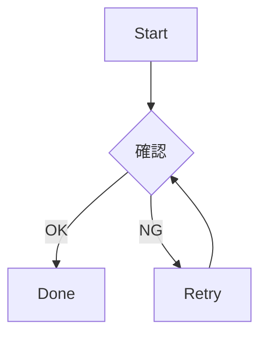
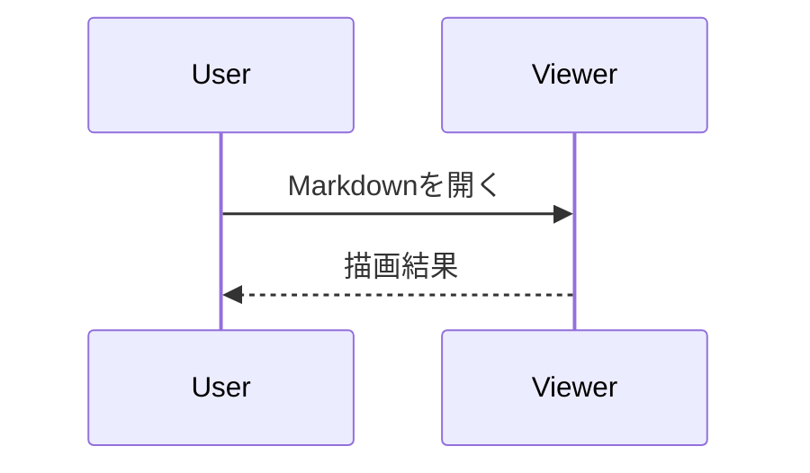
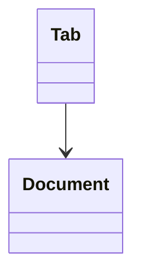
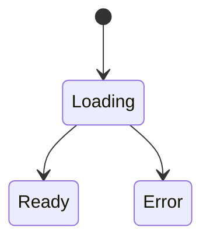
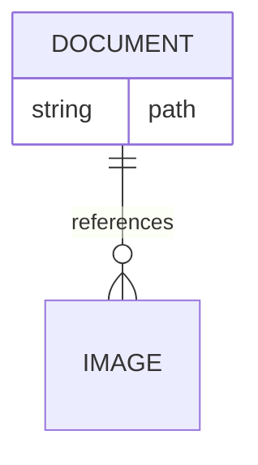
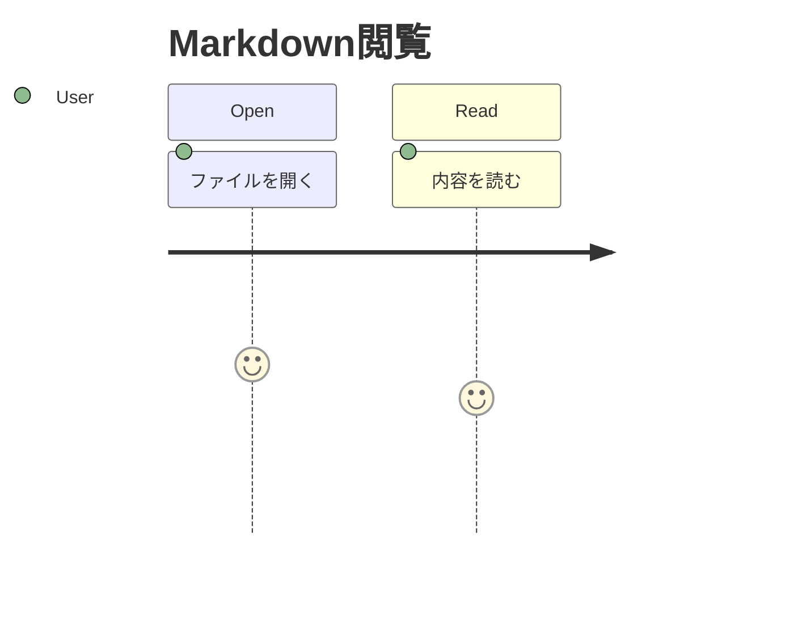
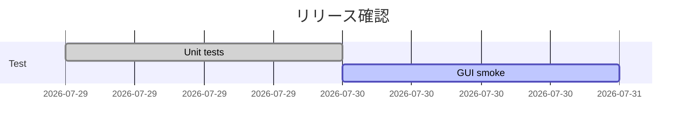

# Mermaid 代表図ギャラリー

## Flowchart

```mermaid
flowchart TD
  Start --> Check{確認}
  Check -->|OK| Done
  Check -->|NG| Retry
  Retry --> Check
```

## Sequence

```mermaid
sequenceDiagram
  participant U as User
  participant V as Viewer
  U->>V: Markdownを開く
  V-->>U: 描画結果
```

## Class

```mermaid
classDiagram
  class Document
  class Tab
  Tab --> Document
```

## State

```mermaid
stateDiagram-v2
  [*] --> Loading
  Loading --> Ready
  Loading --> Error
```

## Entity Relationship

```mermaid
erDiagram
  DOCUMENT ||--o{ IMAGE : references
  DOCUMENT {
    string path
  }
```

## Journey

```mermaid
journey
  title Markdown閲覧
  section Open
    ファイルを開く: 5: User
  section Read
    内容を読む: 4: User
```

## Gantt

```mermaid
gantt
  title リリース確認
  dateFormat YYYY-MM-DD
  section Test
  Unit tests :done, t1, 2026-07-29, 1d
  GUI smoke  :active, t2, after t1, 1d
```
